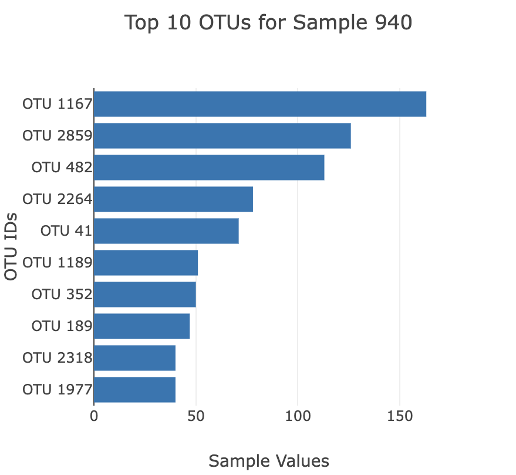
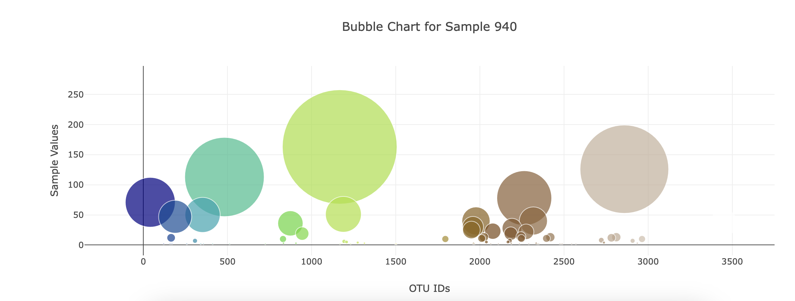
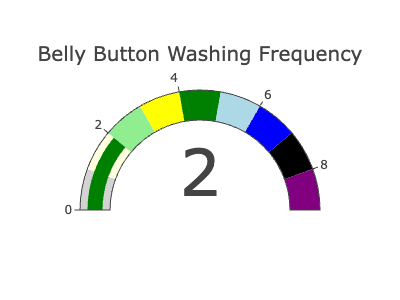

## About
The purpose of this project is to create interactive dashboard to explore the Belly Button Biodiversity dataset, which catalogs the microbes that colonize human navels.  
This visualization can be viewed at https://leena-680.github.io/belly-button-challenge/  

## Tools
- Javascript
- D3
- HTML
- Plotly

## Key Steps
#### **JSON Data**
Use javascript D3 library to read in sample JSON data from a sample [url](https://2u-data-curriculum-team.s3.amazonaws.com/dataviz-classroom/v1.1/14-Interactive-Web-Visualizations/02-Homework/samples.json).

#### **Horizontal Bar Chart**
Created a horizontal bar chart with a dropdown menu to display the top 10 microbial species (also called operational taxonomic units, or OTUs) found in each sample individual.

--------------------------------------------------- 
#### **Bubble Chart**
Created a bubble chart that displayed the OTU values for each selected individual wtih a marker for bubble size and an OTU label on hover.

--------------------------------------------------- 
#### **Metadata**
Showed demographic data for each selected individual, displayed as key:value pairs.

--------------------------------------------------- 
#### **Bonus**
Created a gauge chart that displayed the weekly washing frequency of the selected individual. The data was filtered from 
`metadata.wfreq` in the json data.
The example gauge code was modified to account for values ranging from 0 through 9.

